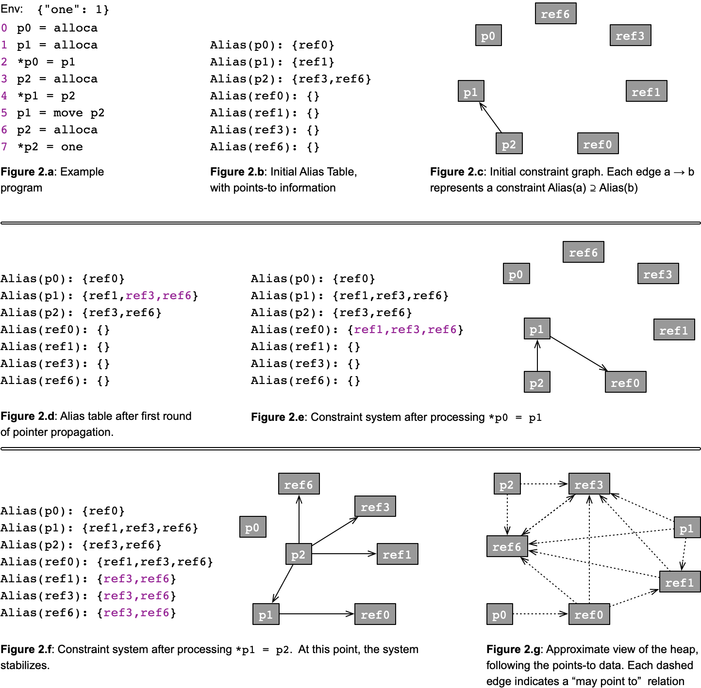

# Alias Analysis

We say that two pointers, p0 and p1, are aliases if they can point to the same memory location.
Alias analysis is a "may" static analysis that approximates the set of memory locations that each pointer can point to.
Thus, the goal of this analysis is to build a table, henceforth called an
*environment* that associates each pointer *p* with the memory locations that
*p* can point to.
The goal of this lab is to implement an Anderson-style points-to analysis, following the techniques seen in the [classroom](https://homepages.dcc.ufmg.br/~fernando/classes/dcc888/ementa/slides/PointerAnalysis.pdf).

## The Assignment

The goal of this lab is to finish the implementation of [alias.py](alias.py).
This file contains one method `abstract_interp`, which you must implement.
This method receives as input a list of instructions, and returns the environment of points-to information created by these instructions.
In addition to the instructions in our previous labs, we shall have to deal with four new kinds of instructions:

1. `v = alloca`: Creates a new memory location (called ir `r`), and makes `v` point to `r`.
2. `v = move w`: Moves the contents of `w` into `v`.
3. `*v = w`: Stores the contents of `w` into the memory location referenced by `v`.
4. `w = *v`: Loads the contents of the memory location references by `v` into `w`.

We shall be solving alias analysis using [Andersen's](http://www.cs.cornell.edu/courses/cs711/2005fa/papers/andersen-thesis94.pdf) approach.
Lars Ole Andersen solved alias analysis as a set of *Inclusion-Based* constraints such as `Alias(a) >= Alias(b)`, meaning that anything that `b` points to might also be pointed to by `a`.
The different instructions in the program give origin to constraints like these.
However, alias analysis cannot be solved just like a simple data-flow analysis, because the set of constraints is not known beforehand.
More constraints are created as we discover more points-to relations.
Figure 1 shows how these constraints are created.


In Figure 1 we use the notation `Prog:Lx` to denote Line `x` of the program.
The line number is only important to name memory locations.
We call every memory location created at line `x` as `ref_x`.
So, to solve alias analysis we do as follows:

1. Process all the initialization constraints, to populate the environment (the Alias table in Figure 1) with points-to information.
2. Create a new set *G* of inclusion-based constraints with all the move instructions. Each move instruction such as `a = b` will add a constraint `Alias(a) >= Alias(b)` to *G*.
3. Repeat the following steps, until the alias sets stop changing:
  1. For each constraint `Alias(a) >= Alias(b)` in *G*, move all the points-to information from `Alias(b)` into `Alias(a)`.
  2. For each instruction `*v = w`, for each `t` in `Alias(v)`, add a new constraint `Alias(t) >= Alias(w)` to *G*.
  3. For each instruction `w = *v`, for each `t` in `Alias(v)`, add a new constraint `Alias(w) >= Alias(t)` to *G*.

Figure 2 below shows an example of how this algorithm works.



## Uploading the Assignment

Students enrolled in DCC888 have access to UFMG's grading system, via [Moodle](https://moodle.org/).
You must upload four python files to have your assignment graded: [driver.py](driver.py), [lang.py](lang.py), [parser.py](parser.py) and
[alias.py](alias.py).
Remember to click on "*Avaliar*" to have your assignment graded.

## Testing without Moodle

As in the previous labs, all the files in this exercise contain `doctest` comments.
You can easily test your implementation by doing, for instance:

```
python3 -m doctest alias.py
```

This lab also provides a [folder](tests) with some test cases.
To simulate automatic grading, you can run [drive.py](driver.py) directly, e.g.:

```
python3 driver.py < tests/ref0.txt
```

In this exercise, the driver prints the table of points-to information.