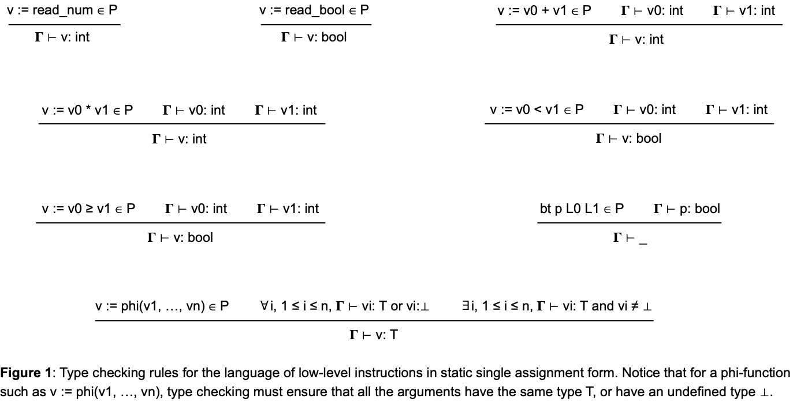

# Type Checking

If a language's syntax supports Type rules, the program can be type-checked to avoid [**stuck states**](https://homepages.dcc.ufmg.br/~fernando/classes/dcc888/ementa/slides/TypeSystems.pdf). **Stuck states** happen when a program must execute an operation with incompatible data, here seen as an instruction with incorrect types. Similarly to semantic rules, a program may be interpreted according to the type rules. If the program does not encounter a **stuck state**, it is sound, or **Safe**. A type-safe program has guaranteed *Progress* and *Preservation*.

- *Progress* implies that no instruction gets stuck: they can always be evaluated.
- *Preservation* implies that the program always progresses from a type-safe state to a type-safe state.

## Pre-Requisites

In order to pass every test in this assignment you are expected to have solved the [Phi-Function](../PhiFunctions/) lab and the [Parsing](../Parsing) lab.
Make sure your parser exists in a file called `parser.py`.

## The Assignment

In this lab we must build a simple type-checker in the model language. In order to do this, a new set of features has been implemented onto [lang.py](lang.py):

- A new `TypeEnv` class extends the `Env` class and is used for type-checking.
- A new `InstTypeErr` exception to be raised when a given program has a type-invalid instruction
- The `Read` instruction has been split into the typed instructions ReadNum and ReadBool
- All instructions (`Add`, `Mul`, `Lth`, `Geq`, `Bt`, `Phi`, `PhiBlock`, `ReadNum`, `ReadBool`) have a `type_eval` method.
- A new global `type_check` function was added to [lang.py](lang.py).

In order to implement the type-checker, all `type_eval` methods must be implemented.
If an instruction fails to type check, then an `InstTypeErr` exception must be raised.
Type checking happens at the `type_check` function, which is already implemented for you.
This function iterates over the list of instructions and, by using `type_eval`, verifies if the whole program is sound.
The implementation of `type_eval` follows the type checking rules in Figure 1.



## Uploading the Assignment

Students enrolled in DCC888 have access to UFMG's grading system, via [Moodle](https://moodle.org/).
You must upload three python files to have your assignment graded: [driver.py](driver.py), [lang.py](lang.py) and [parser.py](parser.py)
Remember to click on "*Avaliar*" to have your assignment graded.

## Testing without Moodle

As in the previous labs, all the files in this exercise contain `doctest` comments.
You can easily test your implementation by doing, for instance:

```
python3 -m doctest lang.py
```

This lab also provides a [folder](tests) with some test cases.
To simulate automatic grading, you can run [drive.py](driver.py) directly, e.g.:

```
python3 driver.py < tests/fib.txt
```

## Theoretical Questions

1. The implementation of `type_check` evaluates all the instructions once, except phi-functions.
On a strict-SSA form program, if we evaluate instructions on the order defined by the program's dominator tree, then we are guaranteed to have evaluated all the uses of an instruction *I* upon having to evaluate *I*.
The only exception for this property are the phi-functions.

2. Figure 2.g shows an image of the heap, produced with a solution of the alias analysis. Each dashed line from `a` to `b` indicates that the pointer `a` can reference the memory location `b`. If such an edge exists, then is it the case that necessarily the address of `b` will ever be the value of `a`?

3. Let's take a look into the complement of Question 2 above: if the solution of the alias analysis does not determine a dashed edge from `a` to `b`, does it mean that there is no way, ever, that during the execution of the program, variable `a` can point to variable `b`?

4. The constraints such as `Alias(a) >= Alias(b)`, which are either created by `Move` instructions, or as a result of the evaluation of the complex constraints, determine a graph. Figures 2.c, 2.e and 2.f show instances of this points-to graph. A efficient way to solve a constraint system is to collapse cycles in this graph, unifying the points-to information of all the nodes in the strong component that was merged.
See Section 2 of the [Wave Propagation Paper](https://homepages.dcc.ufmg.br/~fernando/publications/papers/CGO09.pdf) for more details.
Why is it correct to merge nodes involved in a cycle?