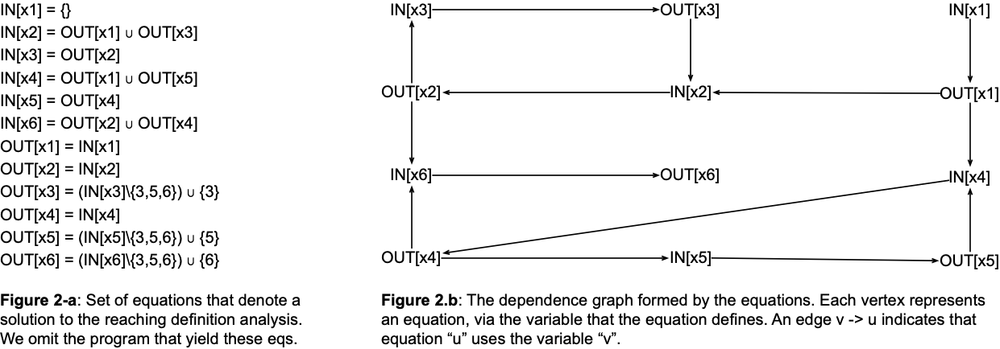

# Worklist-based Algorithms

In our last [lab](../IntroDataFlow) we had an introduction about the
[data-flow framework](https://homepages.dcc.ufmg.br/~fernando/classes/dcc888/ementa/slides/IntroDataFlow.pdf).
In that lab, we were solving data-flow equations via a technique called [chaotic iterations](https://youtu.be/z1ksufuIwcY?feature=shared).
The Chaotic Iteration method is rather slow.
In other words, one could do much faster using various different techniques,
which are the subject of our class on [algorithms to solve data-flow
equations](https://homepages.dcc.ufmg.br/~fernando/classes/dcc888/ementa/slides/WorkList.pdf).
In this lab, we shall implement one of these techniques: we shall use a worklist
to reduce the number of times we evaluate each equation of our data-flow
system.
The figure below illustrates how the new approach, based on a worklist, differs
from our original implementation of the data-flow solver:


## The Assignment

To solve this lab, you will have to have solved the [parsing exercise](../Parsing) (the lab about the implementation of the parser).
Thus, as a preliminary step, rename your parser, from the previous lab, from `todo.py` to `parser.py`.
Notice that this lab contains a file [parser.py](parser.py), which you can replace with the `todo.py` from that previous lab (well, assuming that you have implemented it, of course).
The parser is the only file from the previous lab that you should reuse.

**Dependencies**: The goal of this lab is to implement the worklist-based solver.
This solver uses a notion of "*dependencies*" between equations.
We say that an equation *e0* depends on an equation *e1* if the right-hand side of *e0* uses the variable that *e1* defines.
In this lab, the equations have a `deps` property that return the list of their
dependencies.
This special property is implement for all the equations, except for
`ReachingDefs_IN_Eq`.
Your first task is to implement this property.

**Building the dependence graph**:
once you have implemented all the pending `deps` properties (well, there is only one to be implemented, really), you must use them to build a *dependence graph*.
A dependence graph is a data structure that maps equations equations to lists of equations.
If *G* is a dependence graph, and *e* is an equation, then *G[e]* is the list of all the equations that use *e*.
In this exercise, we are mapping equations by name, e.g., we write
`deps[eq.name()]`, instead of `deps[eq]`.
The function that builds the dependence graph is `build_dependence_graph`.
This function receives a list of equations, and returns the dependence graph
formed by these equations.
You must implement this function.
An example of a system of data-flow equations, and the corresponding dependence graph can be seen in the figure below.




## Uploading the Assignment

Students enrolled in DCC888 have access to UFMG's grading system, via [Moodle](https://moodle.org/).
You must upload four python files to have your assignment graded: [driver.py](driver.py), [lang.py](lang.py), [parser.py](parser.py) and
[dataflow.py](dataflow.py).
Remember to click on "*Avaliar*" to have your assignment graded.

## Testing without Moodle

As in the previous labs, all the files in this exercise contain `doctest` comments.
You can easily test your implementation by doing, for instance:

```
python3 -m doctest dataflow.py
```

This lab also provides a [folder](tests) with some test cases.
To simulate automatic grading, you can run [drive.py](driver.py) directly, e.g.:

```
python3 driver.py < tests/fib.txt
```
